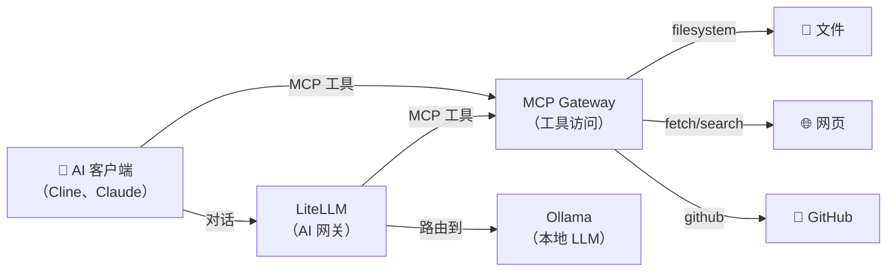
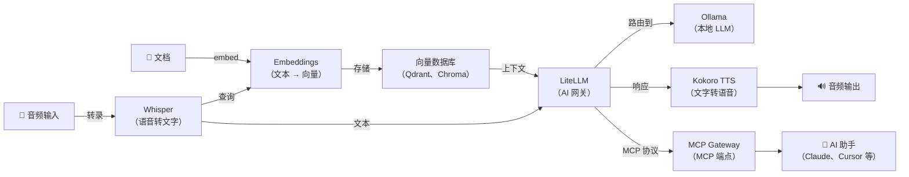

[English](README.md) | [简体中文](README-zh.md) | [繁體中文](README-zh-Hant.md) | [Русский](README-ru.md)

# Docker 上的 MCP Gateway

[](https://github.com/hwdsl2/docker-mcp-gateway/actions/workflows/main.yml) &nbsp;[](https://opensource.org/licenses/MIT)

用于运行自托管 [MCP](https://modelcontextprotocol.io/)（模型上下文协议）网关的 Docker 镜像，通过单一端点提供对多个 MCP 工具服务器的经认证访问。基于 [MCPHub](https://github.com/samanhappy/mcphub) 和 Caddy 认证代理。设计简单，并默认安全。

**功能特性：**

- **默认安全** — 所有 API 请求均需 Bearer Token（首次启动时自动生成）
- 首次启动时自动生成 API 密钥，并存储在持久化卷中
- 多服务器网关 — 在单一 HTTP 端点后运行多个 MCP 工具服务器
- 路径路由 — 通过 `/mcp` 访问所有服务器，或通过 `/mcp/<名称>` 访问指定服务器
- 支持 Streamable HTTP + SSE 两种 MCP 传输模式
- 仪表板 — 位于 `/` 的 Web UI，用于监控 MCP 服务器状态
- 环境文件配置 — 简单的 `mcp.env` 文件；无需编辑 JSON
- 内置 MCP 服务器：filesystem、fetch、GitHub、Brave Search、Git、PostgreSQL、memory、sequential-thinking
- Caddy 反向代理对所有 API 请求强制执行 Bearer Token 认证（`/health` 健康检查除外）
- 与 [LiteLLM](https://github.com/hwdsl2/docker-litellm) 配合，为任何 LLM 提供 MCP 工具访问
- 通过 [GitHub Actions](https://github.com/hwdsl2/docker-mcp-gateway/actions) 自动构建和发布
- 通过 Docker 卷持久化配置
- 多架构：`linux/amd64`、`linux/arm64`

**另提供：**

- AI/音频：[Whisper (STT)](https://github.com/hwdsl2/docker-whisper/blob/main/README-zh.md)、[Kokoro (TTS)](https://github.com/hwdsl2/docker-kokoro/blob/main/README-zh.md)、[Embeddings](https://github.com/hwdsl2/docker-embeddings/blob/main/README-zh.md)、[LiteLLM](https://github.com/hwdsl2/docker-litellm/blob/main/README-zh.md)、[Ollama (LLM)](https://github.com/hwdsl2/docker-ollama/blob/main/README-zh.md)
- VPN：[WireGuard](https://github.com/hwdsl2/docker-wireguard/blob/main/README-zh.md)、[OpenVPN](https://github.com/hwdsl2/docker-openvpn/blob/main/README-zh.md)、[IPsec VPN](https://github.com/hwdsl2/docker-ipsec-vpn-server/blob/master/README-zh.md)、[Headscale](https://github.com/hwdsl2/docker-headscale/blob/main/README-zh.md)

**提示：** MCP Gateway、Ollama、LiteLLM、Whisper、Kokoro 和 Embeddings 可以[协同使用](#与其他-ai-服务配合使用)，在您自己的服务器上构建完整的私有 AI 技术栈——包含工具访问、本地 LLM、语音输入/输出和语义搜索。

## 安全说明

MCP 服务器没有内置认证。在没有认证的情况下公开暴露它们，与约 175,000 台未经认证公开暴露的 Ollama 服务器属于同类问题（[来源](https://www.sentinelone.com/labs/silent-brothers-ollama-hosts-form-anonymous-ai-network-beyond-platform-guardrails/)）。本镜像通过内置的 Caddy 认证代理对**所有 API 请求强制执行 Bearer Token 认证**，即使端口意外暴露，未授权访问也会被阻止。

## 快速开始

**第一步。** 启动 MCP Gateway：

```bash
docker run \
    --name mcp-gateway \
    --restart=always \
    -v mcp-data:/var/lib/mcp \
    -p 3000:3000/tcp \
    -d hwdsl2/mcp-gateway
```

首次启动时，系统会自动生成 API 密钥并显示在容器日志中。所有 API 请求均需此密钥。

**注意：** 对于面向互联网的部署，**强烈建议**使用[反向代理](#使用反向代理)添加 HTTPS。在这种情况下，还需将 `docker run` 命令中的 `-p 3000:3000/tcp` 替换为 `-p 127.0.0.1:3000:3000/tcp`，以防止直接访问未加密的端口。

**第二步。** 获取 API 密钥：

```bash
# 在容器日志中查看密钥
docker logs mcp-gateway

# 或获取密钥以在脚本中使用
MCP_KEY=$(docker exec mcp-gateway mcp_manage --getkey)
```

API 密钥显示在标有 **MCP Gateway API key** 的方框中。随时可以通过以下命令重新显示：

```bash
docker exec mcp-gateway mcp_manage --showkey
```

**第三步。** 通过 API 测试：

```bash
MCP_KEY=$(docker exec mcp-gateway mcp_manage --getkey)

# 测试 MCP 端点（默认启用 fetch 服务器）
curl http://localhost:3000/mcp \
  -H "Authorization: Bearer $MCP_KEY"

# 检查网关健康状态（无需认证）
curl http://localhost:3000/health
```

**注意：** `docker exec` 管理命令（`mcp_manage`）不需要 API 密钥。

要了解有关如何使用此镜像的更多信息，请阅读以下各节。

## 系统要求

- 已安装 Docker 的 Linux 服务器（本地或云端）
- 至少 512 MB 可用内存
- TCP 端口 3000（或您配置的端口）需可访问

## 下载

从 [Docker Hub 镜像仓库](https://hub.docker.com/r/hwdsl2/mcp-gateway/)获取可信构建版本：

```bash
docker pull hwdsl2/mcp-gateway
```

也可从 [Quay.io](https://quay.io/repository/hwdsl2/mcp-gateway) 下载：

```bash
docker pull quay.io/hwdsl2/mcp-gateway
docker image tag quay.io/hwdsl2/mcp-gateway hwdsl2/mcp-gateway
```

支持平台：`linux/amd64` 和 `linux/arm64`。

## 环境变量

所有变量均为可选。如果未设置，将自动使用安全默认值。

此 Docker 镜像使用以下变量，可在 `env` 文件中声明（参见[示例](mcp.env.example)）：

| 变量 | 说明 | 默认值 |
|---|---|---|
| `MCP_API_KEY` | 用于认证请求的 API 密钥（未设置时自动生成） | 自动生成 |
| `MCP_PORT` | 网关的 TCP 端口（1–65535） | `3000` |
| `MCP_HOST` | 在启动信息和 `--showkey` 输出中显示的主机名或 IP | 自动检测 |
| `MCP_SERVERS` | 要启用的 MCP 服务器列表（逗号分隔） | `fetch` |
| `MCP_ADMIN_PASSWORD` | MCPHub 仪表板管理员账户密码（未设置时首次启动自动生成） | 自动生成 |

**注意：** 在 `env` 文件中，您可以将值用单引号括起来，例如 `VAR='value'`。不要在 `=` 两侧添加空格。如果您更改了 `MCP_PORT`，请相应地更新 `docker run` 命令中的 `-p` 标志。

使用 `env` 文件的示例：

```bash
cp mcp.env.example mcp.env
# 编辑 mcp.env 并设置您的值，然后：
docker run \
    --name mcp-gateway \
    --restart=always \
    -v mcp-data:/var/lib/mcp \
    -v ./mcp.env:/mcp.env:ro \
    -p 3000:3000/tcp \
    -d hwdsl2/mcp-gateway
```

### 可用的 MCP 服务器

在 `MCP_SERVERS` 中列出要启用的服务器（逗号分隔）：

| 服务器 | 所需配置 | 说明 |
|---|---|---|
| `fetch` | — | 获取 URL 并提取内容 |
| `filesystem` | `MCP_FILESYSTEM_DIRS` | 在允许的目录中读写文件 |
| `github` | `MCP_GITHUB_TOKEN` | GitHub API 访问（仓库、Issue、PR） |
| `brave-search` | `MCP_BRAVE_API_KEY` | 通过 Brave Search API 进行网页搜索 |
| `git` | `MCP_GIT_REPO` | Git 仓库工具（状态、diff、提交、日志） |
| `postgres` | `MCP_POSTGRES_URL` | 查询 PostgreSQL 数据库 |
| `memory` | — | 知识图谱/持久化记忆 |
| `sequential-thinking` | — | 结构化思考与推理 |

**示例：**

```bash
# 启用 filesystem、fetch 和 GitHub 服务器
MCP_SERVERS=filesystem,fetch,github
MCP_FILESYSTEM_DIRS=/data/docs,/data/projects
MCP_GITHUB_TOKEN=ghp_your_token_here
```

对于 `filesystem` 服务器，需将主机目录挂载到容器中：

```bash
docker run \
    --name mcp-gateway \
    --restart=always \
    -v mcp-data:/var/lib/mcp \
    -v ./mcp.env:/mcp.env:ro \
    -v /home/user/documents:/data/docs:ro \
    -v /home/user/projects:/data/projects \
    -p 3000:3000/tcp \
    -d hwdsl2/mcp-gateway
```

对于 `git` 服务器，需将仓库挂载到容器中并设置 `MCP_GIT_REPO`：

```bash
MCP_SERVERS=git
MCP_GIT_REPO=/repo
```

```bash
docker run \
    --name mcp-gateway \
    --restart=always \
    -v mcp-data:/var/lib/mcp \
    -v ./mcp.env:/mcp.env:ro \
    -v /home/user/myrepo:/repo \
    -p 3000:3000/tcp \
    -d hwdsl2/mcp-gateway
```

## 管理 MCP 服务器

使用 `docker exec` 通过 `mcp_manage` 辅助脚本管理网关。

**列出已启用的服务器：**

```bash
docker exec mcp-gateway mcp_manage --list
```

**测试指定服务器：**

```bash
docker exec mcp-gateway mcp_manage --test fetch
docker exec mcp-gateway mcp_manage --test github
```

**显示网关状态：**

```bash
docker exec mcp-gateway mcp_manage --status
```

**显示 API 密钥：**

```bash
docker exec mcp-gateway mcp_manage --showkey
```

**获取 API 密钥**（机器可读，用于脚本）：

```bash
MCP_KEY=$(docker exec mcp-gateway mcp_manage --getkey)
```

**在运行时添加或删除服务器：**

使用 MCPHub 仪表板（`http://<服务器>:3000/`）在不重启容器的情况下添加、配置或删除 MCP 服务器。更改将保存到持久卷并在重启后保留。

> **注意：** `MCP_SERVERS` 仅在**首次运行**创建 `mcp_settings.json` 时生效。此后，仪表板是管理服务器的方式。要重新应用 `MCP_SERVERS`，请删除配置文件并重启：
> ```bash
> docker exec mcp-gateway rm /var/lib/mcp/mcp_settings.json
> docker restart mcp-gateway
> ```

## 使用 API

所有 API 请求均需 Bearer Token。首先获取 API 密钥：

```bash
MCP_KEY=$(docker exec mcp-gateway mcp_manage --getkey)
```

**MCP 端点（所有已启用服务器）：**

```bash
curl http://localhost:3000/mcp \
  -H "Authorization: Bearer $MCP_KEY"
```

**MCP 端点（指定服务器）：**

```bash
curl http://localhost:3000/mcp/fetch \
  -H "Authorization: Bearer $MCP_KEY"
```

**仪表板**（Web UI）：

在浏览器中打开 `http://localhost:3000/`，并添加 `Authorization: Bearer <key>` 请求头，或使用支持请求头注入的客户端。

**健康检查**（无需认证）：

```bash
curl http://localhost:3000/health
```

### 连接 AI 客户端

**Cline（VS Code）** — 在 Cline 的 MCP 设置中：

```json
{
  "mcpServers": {
    "gateway": {
      "url": "http://localhost:3000/mcp",
      "transport": "sse",
      "headers": {
        "Authorization": "Bearer <api_key>"
      }
    }
  }
}
```

**Claude Desktop** — 在 `claude_desktop_config.json` 中：

```json
{
  "mcpServers": {
    "gateway": {
      "url": "http://localhost:3000/mcp",
      "transport": "streamable-http",
      "headers": {
        "Authorization": "Bearer <api_key>"
      }
    }
  }
}
```

## 持久化数据

所有网关数据存储在 Docker 卷中（容器内的 `/var/lib/mcp`）：

```
/var/lib/mcp/
├── mcp_settings.json   # 生成的 MCPHub 配置
├── .api_key            # API 密钥（自动生成，或从 MCP_API_KEY 同步）
├── .initialized        # 首次运行标记
├── .port               # 保存的端口（供 mcp_manage 使用）
├── .server_addr        # 缓存的服务器地址（供 mcp_manage --showkey 使用）
├── .servers            # 已启用服务器列表（供 mcp_manage 使用）
└── .Caddyfile          # 生成的 Caddy 配置（认证代理）
```

`mcp_settings.json` 仅在首次运行时根据 `MCP_SERVERS` 生成。后续重启将重用现有文件，保留通过仪表板所做的任何更改。

备份 Docker 卷以保留您的配置和 API 密钥。

## 使用 docker-compose

```bash
cp mcp.env.example mcp.env
# 编辑 mcp.env 并设置您的值，然后：
docker compose up -d
docker logs mcp-gateway
```

`docker-compose.yml` 示例（已包含）：

```yaml
services:
  mcp-gateway:
    image: hwdsl2/mcp-gateway
    container_name: mcp-gateway
    restart: always
    ports:
      - "3000:3000/tcp"
    volumes:
      - mcp-data:/var/lib/mcp
      - ./mcp.env:/mcp.env:ro
      # 挂载主机目录用于 filesystem MCP 服务器（可选）：
      # - /path/to/docs:/data/docs:ro
      # - /path/to/code:/data/code:ro

volumes:
  mcp-data:
```

**注意：** 对于面向互联网的部署，**强烈建议**使用[反向代理](#使用反向代理)添加 HTTPS。在这种情况下，还需将 `docker-compose.yml` 中的 `"3000:3000/tcp"` 改为 `"127.0.0.1:3000:3000/tcp"`，以防止直接访问未加密的端口。

## 使用反向代理

如需面向公网部署，可在 MCP Gateway 前置反向代理处理 HTTPS 终止。在本地或可信网络中使用无需 HTTPS，但将 API 端点暴露在公网时建议启用 HTTPS。

从反向代理访问 MCP Gateway 容器时使用以下地址之一：

- **`mcp-gateway:3000`** — 如果反向代理作为容器运行在与 MCP Gateway **同一 Docker 网络**中（例如定义在同一 `docker-compose.yml` 中）。
- **`127.0.0.1:3000`** — 如果反向代理运行在**主机上**且端口 `3000` 已发布（默认 `docker-compose.yml` 会发布该端口）。

**注意：** `Authorization: Bearer` 头会自动通过反向代理传递，无需特殊配置。

**使用 [Caddy](https://caddyserver.com/docs/)（[Docker 镜像](https://hub.docker.com/_/caddy)）的示例**（自动 Let's Encrypt TLS，反向代理在同一 Docker 网络中）：

`Caddyfile`：
```
mcp.example.com {
  reverse_proxy mcp-gateway:3000
}
```

**使用 nginx 的示例**（反向代理运行在主机上）：

```nginx
server {
    listen 443 ssl;
    server_name mcp.example.com;

    ssl_certificate     /path/to/cert.pem;
    ssl_certificate_key /path/to/key.pem;

    location / {
        proxy_pass         http://127.0.0.1:3000;
        proxy_set_header   Host $host;
        proxy_set_header   X-Real-IP $remote_addr;
        proxy_set_header   X-Forwarded-For $proxy_add_x_forwarded_for;
        proxy_set_header   X-Forwarded-Proto $scheme;
        proxy_http_version 1.1;       # SSE 和 WebSocket 所需
        proxy_read_timeout 300s;
        proxy_buffering    off;
        proxy_set_header   Upgrade $http_upgrade;
        proxy_set_header   Connection "upgrade";
    }
}
```

设置反向代理后，在 `env` 文件中设置 `MCP_HOST=mcp.example.com`，以便在启动日志和 `mcp_manage --showkey` 输出中显示正确的端点 URL。

## 更新 Docker 镜像

要更新 Docker 镜像和容器，请先[下载](#下载)最新版本：

```bash
docker pull hwdsl2/mcp-gateway
```

如果 Docker 镜像已是最新版本，您将看到：

```
Status: Image is up to date for hwdsl2/mcp-gateway:latest
```

否则，将下载最新版本。删除并重新创建容器：

```bash
docker rm -f mcp-gateway
# 然后使用相同的卷重新运行快速开始中的 docker run 命令。
```

您的配置和 API 密钥保存在 `mcp-data` 卷中。

## 与其他 AI 服务配合使用

[MCP Gateway](https://github.com/hwdsl2/docker-mcp-gateway)、[Ollama (LLM)](https://github.com/hwdsl2/docker-ollama)、[LiteLLM](https://github.com/hwdsl2/docker-litellm)、[Whisper (STT)](https://github.com/hwdsl2/docker-whisper)、[Kokoro (TTS)](https://github.com/hwdsl2/docker-kokoro) 和 [Embeddings](https://github.com/hwdsl2/docker-embeddings) 镜像可以组合使用，在您自己的服务器上构建完整的私有 AI 技术栈——从语音输入/输出到 RAG 问答。MCP Gateway 为支持 MCP 的任何 LLM 客户端提供工具（文件访问、网页搜索、GitHub、数据库）。Whisper、Kokoro 和 Embeddings 完全在本地运行。Ollama 在本地运行所有 LLM 推理，无需向第三方发送数据。使用 LiteLLM 接入外部提供商（如 OpenAI、Anthropic）时，您的数据将发送给这些提供商。





| 服务 | 作用 | 默认端口 |
|---|---|---|
| **[Ollama (LLM)](https://github.com/hwdsl2/docker-ollama)** | 运行本地 LLM 模型（llama3、qwen、mistral 等） | `11434` |
| **[LiteLLM](https://github.com/hwdsl2/docker-litellm)** | AI 网关 — 将请求路由到 Ollama、OpenAI、Anthropic 等 100+ 提供商 | `4000` |
| **[Embeddings](https://github.com/hwdsl2/docker-embeddings)** | 将文本转换为向量，用于语义搜索和 RAG | `8000` |
| **[Whisper（语音转文字）](https://github.com/hwdsl2/docker-whisper)** | 将语音音频转录为文本 | `9000` |
| **[Kokoro（文字转语音）](https://github.com/hwdsl2/docker-kokoro)** | 将文本转换为自然语音 | `8880` |
| **[MCP Gateway](https://github.com/hwdsl2/docker-mcp-gateway)** | 为 AI 客户端提供 MCP 工具（文件系统、fetch、GitHub、搜索、数据库） | `3000` |

**将 MCP Gateway 连接到 LiteLLM：**

```yaml
# 在 LiteLLM 配置中，将 MCP 网关添加为工具来源：
mcp_servers:
  - url: http://mcp-gateway:3000/mcp
    transport: sse
    headers:
      Authorization: "Bearer <mcp_api_key>"
```

<details>
<summary><strong>MCP 工具使用示例</strong></summary>

使用 MCP Gateway 为您的 AI 助手提供对文件、网页和 GitHub 的访问权限：

```bash
MCP_KEY=$(docker exec mcp-gateway mcp_manage --getkey)

# 使用 MCP 端点连接 AI 客户端（如 VS Code 中的 Cline）
# 设置 MCP 服务器 URL：http://localhost:3000/mcp
# 设置 Authorization 头：Bearer <api_key>

# 或直接测试 MCP 端点
curl -s http://localhost:3000/mcp \
    -X POST \
    -H "Authorization: Bearer $MCP_KEY" \
    -H "Content-Type: application/json" \
    -H "Accept: application/json, text/event-stream" \
    -d '{"jsonrpc":"2.0","id":1,"method":"initialize","params":{"protocolVersion":"2025-03-26","capabilities":{},"clientInfo":{"name":"test","version":"1.0"}}}'
```

</details>

<details>
<summary><strong>语音管道示例</strong></summary>

转录语音问题，通过 Ollama 获取本地 LLM 响应，然后转换为语音：

```bash
LITELLM_KEY=$(docker exec litellm litellm_manage --getkey)

# 第一步：将音频转录为文本（Whisper）
TEXT=$(curl -s http://localhost:9000/v1/audio/transcriptions \
    -F file=@question.mp3 -F model=whisper-1 | jq -r .text)

# 第二步：通过 LiteLLM 将文本发送给 Ollama 并获取响应
RESPONSE=$(curl -s http://localhost:4000/v1/chat/completions \
    -H "Authorization: Bearer $LITELLM_KEY" \
    -H "Content-Type: application/json" \
    -d "{\"model\":\"ollama/llama3.2:3b\",\"messages\":[{\"role\":\"user\",\"content\":\"$TEXT\"}]}" \
    | jq -r '.choices[0].message.content')

# 第三步：将响应转换为语音（Kokoro TTS）
curl -s http://localhost:8880/v1/audio/speech \
    -H "Content-Type: application/json" \
    -d "{\"model\":\"tts-1\",\"input\":\"$RESPONSE\",\"voice\":\"af_heart\"}" \
    --output response.mp3
```

</details>

<details>
<summary><strong>RAG 管道示例</strong></summary>

将文档嵌入以进行语义搜索，检索上下文，然后使用本地 Ollama 模型回答问题：

```bash
LITELLM_KEY=$(docker exec litellm litellm_manage --getkey)

# 第一步：嵌入文档片段并将向量存储到向量数据库
curl -s http://localhost:8000/v1/embeddings \
    -H "Content-Type: application/json" \
    -d '{"input": "Docker 通过将应用打包在容器中来简化部署。", "model": "text-embedding-ada-002"}' \
    | jq '.data[0].embedding'
# → 将返回的向量与源文本一起存储在 Qdrant、Chroma、pgvector 等中。

# 第二步：查询时，嵌入问题，从向量数据库检索最匹配的片段，
#          然后将问题和检索到的上下文通过 LiteLLM 发送给 Ollama。
curl -s http://localhost:4000/v1/chat/completions \
    -H "Authorization: Bearer $LITELLM_KEY" \
    -H "Content-Type: application/json" \
    -d '{
      "model": "ollama/llama3.2:3b",
      "messages": [
        {"role": "system", "content": "仅使用提供的上下文回答。"},
        {"role": "user", "content": "Docker 是什么？\n\n上下文：Docker 通过将应用打包在容器中来简化部署。"}
      ]
    }' \
    | jq -r '.choices[0].message.content'
```

</details>

<details>
<summary><strong>完整技术栈 docker-compose 示例</strong></summary>

使用一条命令部署所有服务。无需任何设置——所有服务在首次启动时自动进行安全配置。

**资源要求：** 同时运行所有服务至少需要 8 GB 内存（使用小型模型）。对于较大的 LLM 模型（8B+），建议 32 GB 或更多。您可以注释掉不需要的服务以减少内存使用。

```yaml
services:
  ollama:
    image: hwdsl2/ollama-server
    container_name: ollama
    restart: always
    # ports:
    #   - "11434:11434/tcp"  # Uncomment for direct access to Ollama
    volumes:
      - ollama-data:/var/lib/ollama
      # - ./ollama.env:/ollama.env:ro  # optional: custom config

  litellm:
    image: hwdsl2/litellm-server
    container_name: litellm
    restart: always
    ports:
      - "4000:4000/tcp"
    environment:
      - LITELLM_OLLAMA_BASE_URL=http://ollama:11434
    volumes:
      - litellm-data:/etc/litellm
      # - ./litellm.env:/litellm.env:ro  # optional: custom config

  embeddings:
    image: hwdsl2/embeddings-server
    container_name: embeddings
    restart: always
    ports:
      - "8000:8000/tcp"
    volumes:
      - embeddings-data:/var/lib/embeddings
      # - ./embed.env:/embed.env:ro  # optional: custom config

  whisper:
    image: hwdsl2/whisper-server
    container_name: whisper
    restart: always
    ports:
      - "9000:9000/tcp"
    volumes:
      - whisper-data:/var/lib/whisper
      # - ./whisper.env:/whisper.env:ro  # optional: custom config

  kokoro:
    image: hwdsl2/kokoro-server
    container_name: kokoro
    restart: always
    ports:
      - "8880:8880/tcp"
    volumes:
      - kokoro-data:/var/lib/kokoro
      # - ./kokoro.env:/kokoro.env:ro  # optional: custom config

  mcp:
    image: hwdsl2/mcp-gateway
    container_name: mcp
    restart: always
    ports:
      - "3000:3000/tcp"
    volumes:
      - mcp-data:/var/lib/mcp
      # - ./mcp.env:/mcp.env:ro  # optional: custom config

volumes:
  ollama-data:
  litellm-data:
  embeddings-data:
  whisper-data:
  kokoro-data:
  mcp-data:
```

若要使用 NVIDIA GPU 加速，将 ollama、whisper 和 kokoro 的镜像标签改为 `:cuda`，并为每个服务添加以下内容：

```yaml
    deploy:
      resources:
        reservations:
          devices:
            - driver: nvidia
              count: 1
              capabilities: [gpu]
```

</details>

## 技术细节

- 基础镜像：`samanhappy/mcphub`（Python 3.13 + Node.js 22）
- 认证代理：[Caddy](https://caddyserver.com)（始终启用，强制执行 Bearer Token 认证）
- 网关：[MCPHub](https://github.com/samanhappy/mcphub)（多服务器 MCP 集线器）
- MCPHub 内部端口：`3001`（未发布；Caddy 从 `MCP_PORT` 代理）
- 数据目录：`/var/lib/mcp`（Docker 卷）
- 网关 API：`http://localhost:3000`（或您配置的端口）
- MCP 端点：`http://localhost:3000/mcp`
- 多架构：`linux/amd64`、`linux/arm64`

## 许可协议

**注意：** 预构建镜像中的软件组件（如 MCPHub、Caddy 及其依赖项）遵循其各自版权持有者选择的许可证。与任何预构建镜像的使用一样，镜像用户有责任确保对此镜像的任何使用均符合其中包含的所有软件的相关许可证。

版权所有 (C) 2026 Lin Song   
本作品基于 [MIT 许可证](https://opensource.org/licenses/MIT)授权。

**MCPHub** 版权所有 (C) 2025 samanhappy，基于 [Apache 许可证 2.0](https://github.com/samanhappy/mcphub/blob/main/LICENSE) 分发。

**Caddy** 版权所有 (C) 2015 Matthew Holt 和 Caddy 作者，基于 [Apache 许可证 2.0](https://github.com/caddyserver/caddy/blob/master/LICENSE) 分发。

本项目是 MCPHub 的独立 Docker 配置，与 MCPHub 没有任何关联、背书或赞助关系。